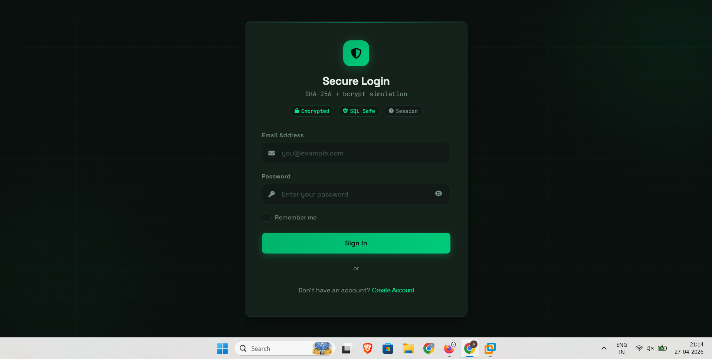

# 🔐 Secure Login System

A secure login system built using HTML, CSS, and JavaScript demonstrating cybersecurity concepts such as password hashing, input validation, session management, and 2FA.

---

## 📌 Overview

This project simulates a secure authentication system with modern UI and security features. It is designed for educational purposes to demonstrate how login systems work.

---

## 🚀 Features

- 🔐 Password hashing simulation (SHA-256 + bcrypt logic)
- 🛡️ Protection against SQL injection (input sanitization)
- 👤 User registration and login system
- 🔑 Password strength validation
- ⏱️ Session management (login/logout)
- 🔒 Two-Factor Authentication (2FA simulation)
- 📊 Activity logging system
- 🎨 Modern responsive UI

---

## 📸 Screenshot

---

## 🛠️ Technologies Used

- HTML5
- CSS3
- JavaScript
- LocalStorage (for simulation)

---

## ⚠️ Disclaimer

This project is a **frontend simulation** and does not use a real backend or database.

In real-world applications:
- Passwords are hashed using bcrypt on the server
- Data is stored securely in databases
- Backend frameworks like Flask or Node.js are used

---

## ▶️ How to Run

1. Download or clone this repository
2. Open `index.html` in your browser

---

## 🔐 Security Concepts Implemented

- Password hashing logic
- Input validation
- SQL injection prevention
- Session handling
- Two-Factor Authentication simulation

---

## 👨‍💻 Author

Marsellino Nasry Mounir  
Cybersecurity Student
